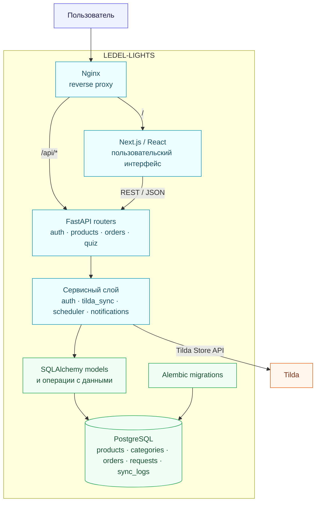
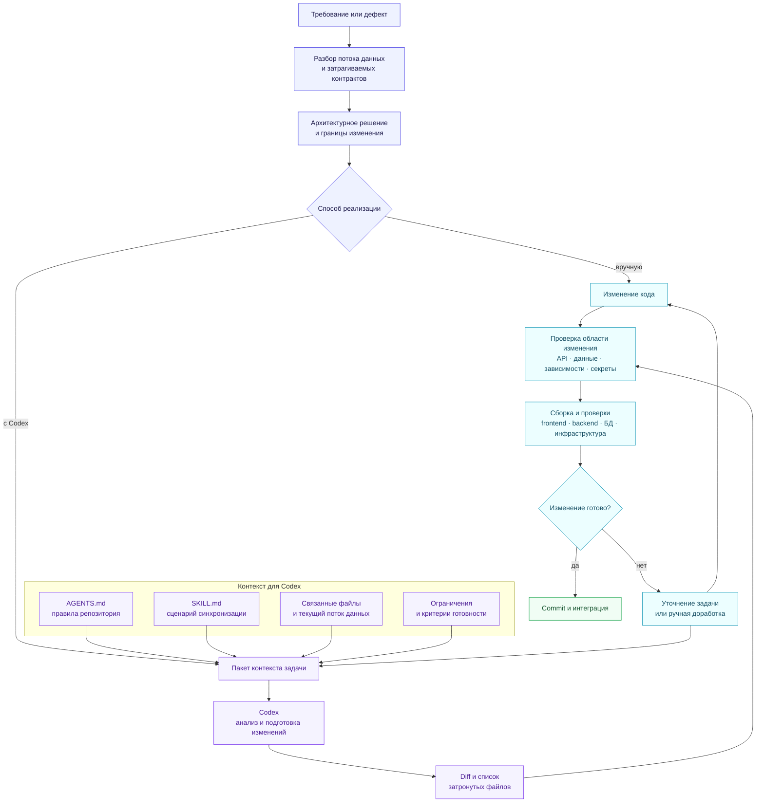

# О проекте

LEDEL-LIGHTS - приложение, разработанное в ходе переноса проекта с Tilda на собственную архитектуру. Это интернет-магазин светильников с каталогом, формами заявок и панелью для менеджера. Товары загружаются из Tilda и сохраняются в собственной БД.

**Проект предназначен для демонстрационного и локального запуска.**

**Стек проекта:**
- **Next.js:** пользовательский интерфейс
- **FastAPI:** backend и API
- **PostgreSQL:** хранение данных
- **Nginx:** единая точка входа и маршрутизация запросов
- **Tilda Store API:** источник товаров для каталога

## Как устроен проект

1. Запросы приходят через Nginx.
2. Пользовательские страницы обслуживает frontend, а обращения к `/api/*` передаются backend.
3. Обработчики API находятся в `backend/routers/`, интеграции и фоновые задачи размещены в `backend/services/`, а модели данных описаны в `backend/models/`.
4. Изменения структуры PostgreSQL оформляются миграциями Alembic.



Backend работает на Python 3.11, FastAPI, SQLAlchemy 2, Alembic и PostgreSQL 15. Frontend собран на Next.js 16, React 19, TypeScript и Tailwind CSS. Сервисы запускаются через Docker Compose, а Nginx служит единой точкой входа. Для административных операций используются JWT-аутентификация и SQLAdmin.

```text
LEDEL-LIGHTS/
├── AGENTS.md
├── .agents/
│   └── skills/
│       └── tilda-catalog-sync/
├── backend/
│   ├── alembic/
│   ├── crud/
│   ├── models/
│   ├── routers/
│   ├── services/
│   └── main.py
├── frontend/
│   ├── public/
│   └── src/
├── nginx/
├── scripts/
├── docker-compose.yml
└── .env.example
```

## Запуск проекта

Для локального запуска нужны Git, Docker Engine или Docker Desktop и Docker Compose.

1. Скопируйте пример настроек в локальный файл окружения:

   ```powershell
   Copy-Item .env.example .env
   ```

2. Замените в `.env` демонстрационные значения `JWT_SECRET_KEY`, `ADMIN_USERNAME` и `ADMIN_PASSWORD` на собственные.

3. Соберите и запустите приложение:

   ```bash
   docker compose up -d --build
   ```

4. Убедитесь, что сервисы запущены:

   ```bash
   docker compose ps
   ```

После запуска адреса сервисов будут такими: frontend <http://localhost:3000>, API <http://localhost:8000>, Swagger UI <http://localhost:8000/docs>, административная панель <http://localhost:8000/admin>. Через Nginx приложение открывается на <http://localhost>.

Для остановки выполните `docker compose down`. Журналы всех сервисов можно посмотреть командой `docker compose logs -f`. Для просмотра только backend используйте `docker compose logs -f backend`.

## Настройка окружения

В корне лежит `.env.example` с полным набором параметров.

| Переменная | Назначение | Пример безопасного значения |
|---|---|---|
| `POSTGRES_USER` | Пользователь PostgreSQL | `ledl_user` |
| `POSTGRES_PASSWORD` | Пароль PostgreSQL | `<strong-password>` |
| `POSTGRES_DB` | Имя базы данных | `ledl_db` |
| `DATABASE_URL` | Строка подключения backend к PostgreSQL | `postgresql://ledl_user:<password>@db:5432/ledl_db` |
| `DEBUG` | Режим отладки FastAPI | `True` |
| `ALLOWED_ORIGINS` | Разрешённые CORS-домены через запятую | `http://localhost:3000` |
| `JWT_SECRET_KEY` | Ключ подписи JWT | `<random-secret>` |
| `JWT_ACCESS_TOKEN_EXPIRE_MINUTES` | Срок действия токена в минутах | `480` |
| `ADMIN_USERNAME` | Имя администратора | `<admin-name>` |
| `ADMIN_PASSWORD` | Пароль администратора | `<strong-admin-password>` |
| `TILDA_API_URL` | Адрес Tilda Store API | `https://store.tildacdn.com/api/getproductslist/` |
| `TILDA_STORE_PART_UID` | Идентификатор части магазина Tilda | `<store-part-uid>` |
| `TILDA_RECID` | Идентификатор блока Tilda | `<recid>` |
| `NEXT_PUBLIC_APP_NAME` | Название приложения во frontend | `LEDEL-LIGHTS` |
| `NEXT_PUBLIC_API_BASE_URL` | Базовый адрес API для frontend | `http://localhost:8000/api` |
| `SSL_DOMAIN` | Домен для production-конфигурации Nginx | `example.com` |
| `BACKUP_RETENTION_DAYS` | Срок хранения резервных копий | `30` |


## API

API отвечает за каталог, оформление заказов, приём заявок и административные операции. Публичная часть используется витриной, а управление заказами и синхронизацией защищено JWT.

| Часть API | Основной маршрут | Что делает |
|---|---|---|
| Состояние приложения | `GET /api/health` | Проверяет API и подключение к PostgreSQL |
| Авторизация | `/api/auth/*` | Выдаёт и проверяет JWT администратора |
| Каталог | `/api/products/*`, `/api/categories/*` | Отдаёт товары, фильтры и дерево категорий |
| Заказы | `/api/orders/*` | Создаёт заказы и позволяет менеджеру менять их статусы |
| Квиз и формы | `/api/quiz/*`, `/api/contact/*` | Сохраняет заявки посетителей для дальнейшей обработки |
| Синхронизация | `/api/sync/*` | Запускает обновление каталога и показывает его результат |

Полный список методов, параметров и схем данных доступен в Swagger UI: <http://localhost:8000/docs>. Защищённые запросы используют заголовок `Authorization: Bearer <token>`.

## Синхронизация с Tilda

Автоматическая синхронизация выполняется каждый час, с момента запуска приложения. Синхронизацию можно запустить вручную через защищённый API. Сервис получает страницы товаров из Tilda Store API, приводит поля к внутреннему формату, сопоставляет категории и обновляет PostgreSQL. Результат операции сохраняется в `sync_logs`.

При повторной синхронизации существующие товары обновляются, а дубликаты не создаются. Для проверки используются тестовые данные вместо production API.

## Администрирование

Панель SQLAdmin находится по адресу <http://localhost:8000/admin>. Учётные данные задаются переменными `ADMIN_USERNAME` и `ADMIN_PASSWORD`, а API авторизации выдаёт JWT для защищённых операций.

В текущей реализации маршруты просмотра и изменения результатов квиза и обращений не требуют JWT. Это отражено в таблице API и должно учитываться при публикации приложения.

## Разработка с OpenAI Codex

При разработке LEDEL-LIGHTS часть задач выполнялась вручную, часть с помощью OpenAI Codex. Агент помогал менять frontend, backend, базу данных и инфраструктуру. В само приложение он не входит, после внесения изменений все сервисы работают без него.

В [`AGENTS.md`](./AGENTS.md) записаны общие правила проекта: где находится код, что можно менять и какие проверки нужно выполнить. [`SKILL.md`](./.agents/skills/tilda-catalog-sync/SKILL.md) используется только в задачах по синхронизации каталога с Tilda. В нём описан порядок работы с данными и границы таких изменений.

Навык `tilda-catalog-sync` помогает проследить путь товара от Tilda до PostgreSQL, проверить загрузку всех страниц, привести поля к нужному формату и записать результат в `sync_logs`. Структура товара вынесена в [`product-contract.md`](./.agents/skills/tilda-catalog-sync/references/product-contract.md). Поэтому в каждой новой задаче остаётся описать только нужное изменение.



Задача для агента описывает конкретное ожидаемое поведение, границы изменения и критерии готовности. Например:

```text
Используй $tilda-catalog-sync.

Доработай синхронизацию каталога: повторный запуск должен обновлять
существующие товары и не создавать дубликаты.

Сохрани публичные API-маршруты, оставь бизнес-логику в сервисном слое
и фиксируй результат в sync_logs. Если меняется схема БД, добавь миграцию.

Проверь повторный запуск на локальной обезличенной фикстуре, конфигурацию
Docker Compose, сборку backend и ответ GET /api/health.
```

Подготовленный агентом diff проходит те же проверки, что и изменение, написанное вручную. В репозиторий включается проверенный результат, а не исходный ответ агента.

## Проверка изменений

Frontend проверяется командами `npm run lint` и `npm run build` в каталоге `frontend/`. Для backend проверяются конфигурация Docker Compose, запуск сервисов, `GET /api/health` и журналы.

При изменении структуры данных добавляется миграция Alembic и проверяется на локальной базе. Синхронизация тестируется повторным запуском обезличенной фикстуры.

Резервное копирование описано в [`scripts/README.md`](./scripts/README.md), настройка сертификатов — в [`nginx/ssl/README.md`](./nginx/ssl/README.md).
