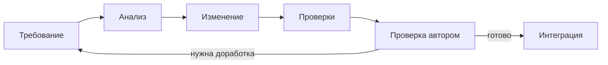

# Разработка с Codex

Часть LEDEL-LIGHTS разрабатывалась с помощью OpenAI Codex. Автор проекта определял требования, границы изменений и критерии готовности. Codex анализировал код, предлагал реализацию, менял файлы и запускал доступные проверки.

## Распределение ответственности

| Автор проекта | Codex |
|---|---|
| Определяет требуемое поведение | Анализирует затронутый поток данных |
| Принимает архитектурные решения | Готовит изменение в заданных границах |
| Проверяет результат в приложении | Запускает доступные проверки |
| Решает, готово ли изменение | Сообщает об ограничениях и рисках |

## Передача контекста

- `AGENTS.md` содержит общие правила репозитория.
- `.agents/skills/tilda-catalog-sync/SKILL.md` задаёт порядок работы с синхронизацией.
- `product-contract.md` описывает поля Tilda, нормализацию и правила upsert.
- Конкретная задача содержит ожидаемое поведение и критерии готовности.

Так агент получает только относящийся к задаче контекст и не меняет несвязанные части проекта.

## Рабочий цикл

## Проверяемый пример

Для задач синхронизации агент должен проверить путь от ответа Tilda до `products` и `sync_logs`, сохранить идентификацию по `uid`, не менять публичные маршруты без требования и использовать обезличенные фикстуры. Реализация этого сценария находится в [сервисе синхронизации](../backend/services/tilda_sync.py).

Конкретные правила доступны в [skill синхронизации](../.agents/skills/tilda-catalog-sync/SKILL.md) и [контракте товара](../.agents/skills/tilda-catalog-sync/references/product-contract.md). Результат проверяется теми же командами, что и ручное изменение.

