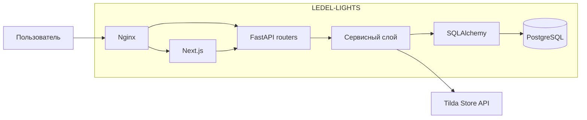

# Архитектура

LEDEL-LIGHTS состоит из четырёх сервисов Docker Compose: Nginx, Next.js, FastAPI и PostgreSQL.

## Компоненты

| Компонент | Ответственность |
|---|---|
| Nginx | Единая точка входа, reverse proxy, HTTPS |
| Next.js | Каталог, страницы товаров, формы и панель менеджера |
| FastAPI | HTTP API, проверка данных и управление запросами |
| Сервисы backend | Аутентификация, синхронизация, планировщик и уведомления |
| SQLAlchemy | Модели и работа с PostgreSQL |
| Alembic | Версионирование структуры базы данных |

## Поток запроса

1. Пользователь открывает приложение через Nginx или порт frontend.
2. Next.js обращается к FastAPI по адресу из `NEXT_PUBLIC_API_BASE_URL`.
3. Router проверяет входные данные и вызывает CRUD или сервисный слой.
4. SQLAlchemy читает или изменяет данные в PostgreSQL.
5. FastAPI возвращает JSON, который отображает frontend.

## Границы модулей

- HTTP-обработка находится в `backend/routers/`.
- Бизнес-логика и внешние интеграции находятся в `backend/services/`.
- Операции с сущностями находятся в `backend/crud/`.
- Модели базы находятся в `backend/models/`.
- Публичные Pydantic-схемы собраны в `backend/schemas.py`.

Синхронизация каталога описана отдельно в [modules/catalog-sync.md](./modules/catalog-sync.md).

