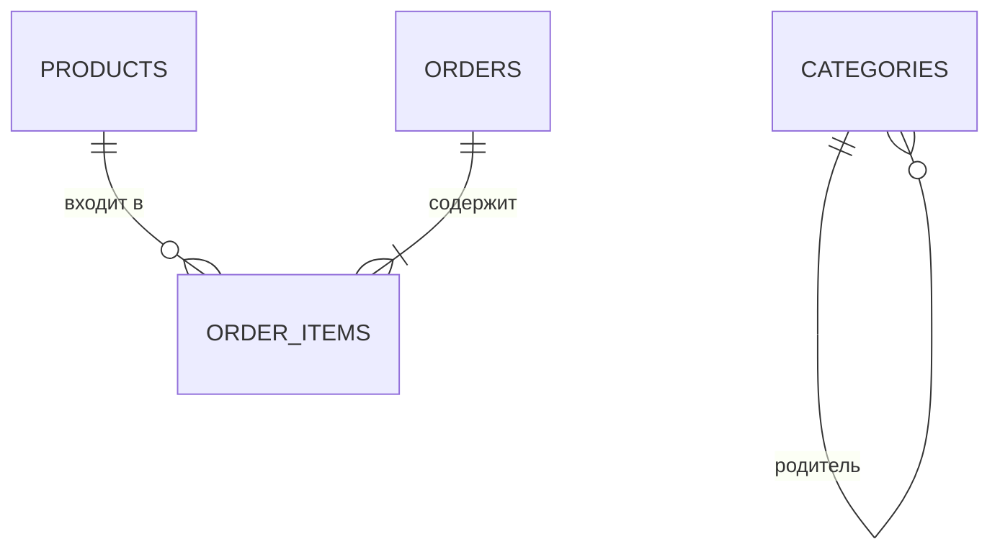

# Модель данных

Данные хранятся в PostgreSQL. SQLAlchemy описывает модели, Alembic хранит историю изменений структуры.

## Таблицы

| Таблица | Назначение |
|---|---|
| `products` | Товары, характеристики, цены и идентификаторы Tilda |
| `categories` | Иерархия категорий |
| `orders` | Заказы и контактные данные клиентов |
| `order_items` | Позиции заказа и снимок данных товара |
| `quiz_results` | Ответы и результаты квиза |
| `contact_form_submissions` | Заявки из форм связи |
| `sync_logs` | Итоги синхронизации каталога |

## Основные связи



- Удаление заказа удаляет его позиции.
- Удаление товара оставляет позицию заказа, но очищает `product_id`.
- Название, артикул и цена товара сохраняются в позиции заказа как снимок.
- `uid` и `tilda_id` используются для поиска товара при синхронизации.

## Миграции

Конфигурация находится в `backend/alembic.ini`, ревизии - в `backend/alembic/versions/`.

Для применения миграций из каталога `backend/`:

```bash
alembic upgrade head
```

Текущий Docker Compose при запуске backend вызывает `Base.metadata.create_all`. Это подходит для первичного локального запуска, но не заменяет проверку миграций при изменении существующей базы.

При изменении структуры данных нужно одновременно обновить модель SQLAlchemy, Pydantic-схему, миграцию Alembic и документацию.

