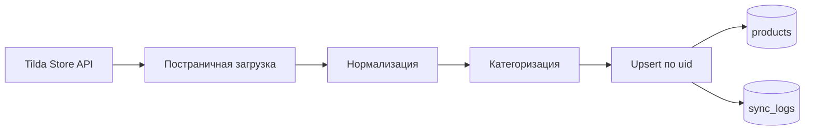

# Синхронизация каталога

Модуль загружает товары из Tilda Store API и сохраняет их в PostgreSQL.

## Компоненты

| Файл | Ответственность |
|---|---|
| `backend/services/tilda_sync.py` | Загрузка, преобразование и upsert |
| `backend/services/scheduler.py` | Автоматический запуск раз в 60 минут |
| `backend/models/product.py` | Модель товара |
| `backend/models/sync_log.py` | Журнал операций |
| `backend/routers/products.py` | Административные маршруты синхронизации |

## Идентификация товара

Внешний `uid` Tilda сохраняется в `products.uid` и `products.tilda_id`.

- найденный товар обновляется;
- новый товар создаётся;
- повторная обработка одного `uid` не должна создавать дубликат;
- `updated_at` и `last_synced_at` обновляются при синхронизации.

## Результат операции

В `sync_logs` сохраняются статус, время, число обработанных, созданных, обновлённых и ошибочных товаров.

Возможные статусы:

- `success` - ошибок нет;
- `partial` - часть товаров обработана с ошибками;
- `error` - товары не были обработаны.

## Ограничения

- Обработка зависит от текущего формата Tilda Store API.
- Изменения фиксируются по одному товару, а не одной общей транзакцией.
- Товар без `uid` не имеет устойчивого внешнего идентификатора.
- Значение цены `0` текущая реализация преобразует в `null`.

Полный контракт полей и пограничных случаев находится в [product-contract.md](../../.agents/skills/tilda-catalog-sync/references/product-contract.md).

