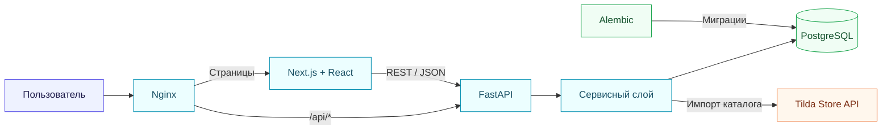
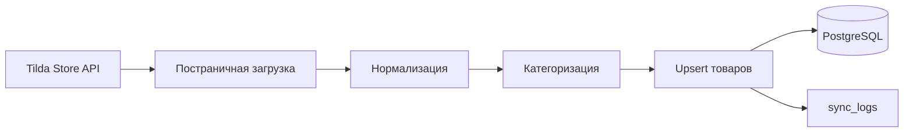

<div align="center">

# 💡 LEDEL-LIGHTS

### Интернет-магазин светильников на собственной frontend/backend-архитектуре

[](https://nextjs.org/)
[](https://fastapi.tiangolo.com/)
[](https://www.postgresql.org/)
[](https://docs.docker.com/compose/)

[](https://github.com/cislota/LEDEL-LIGHTS)
[](https://github.com/cislota/LEDEL-LIGHTS/commits)
[](https://github.com/cislota/LEDEL-LIGHTS)

</div>

---

## ✨ О проекте

**LEDEL-LIGHTS** — интернет-магазин светильников, перенесённый с Tilda на собственную архитектуру. Приложение включает каталог товаров, формы заявок, оформление заказов и панель управления для менеджера.

Каталог автоматически загружается из **Tilda Store API**, нормализуется и сохраняется в PostgreSQL. Повторная синхронизация обновляет существующие товары без создания дубликатов.

> [!NOTE]
> Проект предназначен для демонстрационного и локального запуска.

## 🧰 Технологии

<div align="center">

[](https://skillicons.dev)

</div>

| Область | Технологии |
|---|---|
| **Frontend** | Next.js 16, React 19, TypeScript, Tailwind CSS |
| **Backend** | Python 3.11, FastAPI, SQLAlchemy 2, Alembic |
| **Данные** | PostgreSQL 15, Tilda Store API |
| **Инфраструктура** | Docker Compose, Nginx |
| **Управление** | SQLAdmin, JWT-аутентификация |

## 🏗️ Архитектура



<details>
<summary><strong>Структура проекта</strong></summary>

```text
LEDEL-LIGHTS/
├── backend/
│   ├── alembic/       # миграции базы данных
│   ├── models/        # модели SQLAlchemy
│   ├── routers/       # HTTP-маршруты
│   ├── services/      # бизнес-логика и интеграции
│   └── main.py
├── frontend/
│   ├── public/
│   └── src/
├── nginx/
├── scripts/
├── docker-compose.yml
└── .env.example
```

</details>

## 🚀 Быстрый запуск

### Требования

- Git
- Docker Engine или Docker Desktop
- Docker Compose

### Установка

1. Клонируйте репозиторий:

   ```bash
   git clone https://github.com/cislota/LEDEL-LIGHTS.git
   cd LEDEL-LIGHTS
   ```

2. Создайте локальный файл настроек:

   ```powershell
   Copy-Item .env.example .env
   ```

3. Замените в `.env` демонстрационные значения `JWT_SECRET_KEY`, `ADMIN_USERNAME` и `ADMIN_PASSWORD`.

4. Соберите и запустите приложение:

   ```bash
   docker compose up -d --build
   ```

5. Проверьте состояние сервисов:

   ```bash
   docker compose ps
   ```

## 🔗 Адреса сервисов

| Сервис | Адрес |
|---|---|
| 🌐 Приложение через Nginx | <http://localhost> |
| ⚛️ Frontend | <http://localhost:3000> |
| ⚡ Backend API | <http://localhost:8000> |
| 📚 Swagger UI | <http://localhost:8000/docs> |
| 🔐 Панель администратора | <http://localhost:8000/admin> |

Остановка приложения:

```bash
docker compose down
```

Просмотр журналов:

```bash
docker compose logs -f
```

## 🔌 API

| Возможность | Маршруты | Назначение |
|---|---|---|
| ❤️ Состояние | `GET /api/health` | Проверка API и PostgreSQL |
| 🔑 Авторизация | `/api/auth/*` | Получение и проверка JWT |
| 💡 Каталог | `/api/products/*`, `/api/categories/*` | Товары, фильтры и категории |
| 🛒 Заказы | `/api/orders/*` | Создание заказов и изменение статусов |
| 📝 Формы | `/api/quiz/*`, `/api/contact/*` | Сохранение обращений посетителей |
| 🔄 Синхронизация | `/api/sync/*` | Обновление каталога и просмотр результата |

Полная интерактивная документация доступна в [Swagger UI](http://localhost:8000/docs). Защищённые запросы используют заголовок `Authorization: Bearer <token>`.

## 🔄 Синхронизация каталога



Синхронизация автоматически выполняется каждый час после запуска приложения. Её также можно запустить вручную через защищённый API.

- загружаются все страницы товаров;
- данные приводятся к внутреннему формату;
- существующие записи обновляются;
- дубликаты не создаются;
- результат сохраняется в `sync_logs`.

## ⚙️ Основные настройки

Все параметры перечислены в `.env.example`.

| Переменная | Назначение |
|---|---|
| `DATABASE_URL` | Подключение backend к PostgreSQL |
| `JWT_SECRET_KEY` | Ключ подписи JWT |
| `ADMIN_USERNAME` | Имя администратора |
| `ADMIN_PASSWORD` | Пароль администратора |
| `TILDA_API_URL` | Адрес Tilda Store API |
| `TILDA_STORE_PART_UID` | Идентификатор части магазина |
| `TILDA_RECID` | Идентификатор блока Tilda |
| `NEXT_PUBLIC_API_BASE_URL` | Базовый адрес API для frontend |

> [!WARNING]
> Не добавляйте `.env`, пароли, токены и необработанные production-ответы в репозиторий.

## ✅ Проверка изменений

### Frontend

```bash
cd frontend
npm run lint
npm run build
```

### Backend и инфраструктура

```bash
docker compose config
docker compose up -d --build
docker compose ps
docker compose logs backend
```

После запуска проверьте `GET /api/health`. При изменении структуры данных необходимо добавить и применить миграцию Alembic.

## 📖 Дополнительная документация

- [Правила работы с проектом](./AGENTS.md)
- [Резервное копирование](./scripts/README.md)
- [Настройка SSL](./nginx/ssl/README.md)
- [Навык синхронизации каталога](./.agents/skills/tilda-catalog-sync/SKILL.md)

---

<div align="center">

**LEDEL-LIGHTS** · Next.js · FastAPI · PostgreSQL · Docker

</div>
