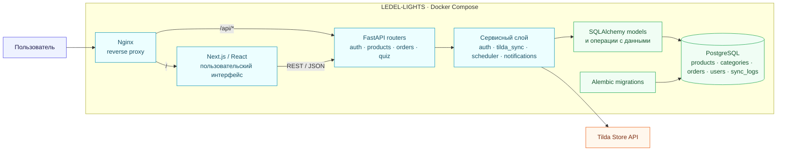
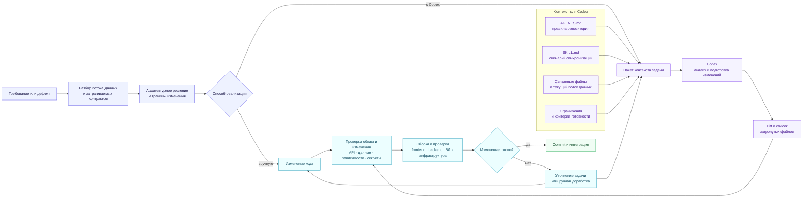
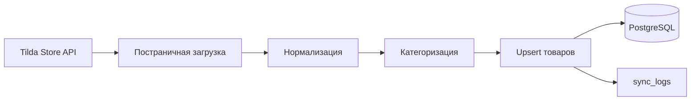

<div align="center">

# 💡 LEDEL-LIGHTS

### Интернет-магазин светильников на собственной frontend/backend-архитектуре

[](https://nextjs.org/)
[](https://fastapi.tiangolo.com/)
[](https://www.postgresql.org/)
[](https://docs.docker.com/compose/)

[](https://github.com/cislota/LEDEL-LIGHTS)
[](https://github.com/cislota/LEDEL-LIGHTS/commits)
[](https://github.com/cislota/LEDEL-LIGHTS)

</div>

---

## О проекте

**LEDEL-LIGHTS** — интернет-магазин светильников, перенесённый с Tilda на собственную архитектуру. Приложение включает каталог товаров, формы заявок, оформление заказов и панель управления для менеджера.

Каталог автоматически загружается из **Tilda Store API**, нормализуется и сохраняется в PostgreSQL. Повторная синхронизация обновляет существующие товары без дублирования.

> [!NOTE]
> Проект предназначен для демонстрационного и локального запуска.

## Технологии

<div align="center">

[](https://skillicons.dev)

</div>

| Область | Технологии |
|---|---|
| **Frontend** | Next.js 16, React 19, TypeScript, Tailwind CSS |
| **Backend** | Python 3.11, FastAPI, SQLAlchemy 2, Alembic |
| **Данные** | PostgreSQL 15, Tilda Store API |
| **Инфраструктура** | Docker Compose, Nginx |
| **Управление** | SQLAdmin, JWT-аутентификация |

## Архитектура



<details>
<summary><strong>Структура проекта</strong></summary>

```text
LEDEL-LIGHTS/
├── backend/
│   ├── alembic/       # миграции базы данных
│   ├── models/        # модели SQLAlchemy
│   ├── routers/       # HTTP-маршруты
│   ├── services/      # бизнес-логика и интеграции
│   └── main.py
├── frontend/
│   ├── public/
│   └── src/
├── nginx/
├── scripts/
├── docker-compose.yml
└── .env.example
```

</details>

## Разработка с OpenAI Codex

При разработке LEDEL-LIGHTS часть функциональности создавалась вручную, часть — с использованием OpenAI Codex. Агент подключался к отдельным задачам во frontend, backend, базе данных и инфраструктурной конфигурации. До начала реализации определялись границы изменения, затрагиваемые сервисы и допустимые изменения API и структуры данных.

Контекст проекта и ограничения передавались через Markdown-инструкции. В публичной версии репозитория этот подход оформлен в виде [`AGENTS.md`](./AGENTS.md) с общими правилами работы и отдельной инструкции [`tilda-catalog-sync`](./.agents/skills/tilda-catalog-sync/SKILL.md) для задач синхронизации каталога. Codex подготавливал изменения в пределах поставленной задачи, после чего полученный diff проходил сборку и функциональную проверку наравне с кодом, написанным вручную.

<div align="center">

[](https://openai.com/codex/)
[](./AGENTS.md)
[](./.agents/skills/tilda-catalog-sync/SKILL.md)

</div>

### Место Codex в процессе разработки

Ручная и агентная разработка не разделялись на два независимых процесса. Codex использовался внутри общего цикла: после проработки задачи и до проверки готового изменения.



Для агента собирался только контекст, относящийся к текущему изменению. Общие ограничения проекта не повторялись в каждой задаче: они находились в `AGENTS.md`. Последовательность действий для повторяемого сценария задавалась в `SKILL.md`, а конкретная задача содержала ожидаемое поведение, границы изменения и критерии готовности.

```text
LEDEL-LIGHTS/
├── AGENTS.md
├── .agents/
│   └── skills/
│       └── tilda-catalog-sync/
│           ├── SKILL.md
│           └── references/
│               └── product-contract.md
├── frontend/
├── backend/
│   ├── routers/
│   ├── services/
│   ├── models/
│   └── alembic/
├── nginx/
└── docker-compose.yml
```

`AGENTS.md` применяется ко всему репозиторию: описывает структуру проекта, допустимые границы изменений и обязательные проверки. Инструкция `tilda-catalog-sync` загружается для задач, связанных с Tilda Store API, нормализацией товаров, сопоставлением категорий, обновлением записей в PostgreSQL и журналированием синхронизации. Файл `references/product-contract.md` содержит схему входных данных, правила преобразования полей и условия upsert; для несвязанных задач агенту не требуется его загружать.

### Пример задачи для агента

Ниже приведён сокращённый пример инструкции для изменения синхронизации каталога. Общие правила репозитория и порядок работы со сценарием агент получает из `AGENTS.md` и `SKILL.md`, поэтому в самой задаче остаются только требования к конкретному изменению.

```text
Используй $tilda-catalog-sync.

Задача
Доработать синхронизацию каталога из Tilda Store API: повторный запуск
должен обновлять существующие товары и не создавать дубликаты.

Текущее поведение
Ответ Tilda обрабатывается в backend/services/tilda_sync.py. Товары
сохраняются в PostgreSQL через существующие модели SQLAlchemy. Результат
операции должен фиксироваться в sync_logs.

Перед изменением
1. Восстанови текущий путь данных от ответа Tilda до записи в PostgreSQL.
2. Определи действующее правило идентификации товара по uid / tilda_id.
3. Укажи, требуется ли изменение API-контракта, моделей или схемы БД.
4. Не изменяй код, не связанный с синхронизацией каталога.

Ограничения
- Сохрани существующие публичные API-маршруты.
- Не переноси логику синхронизации в backend/routers/.
- Не добавляй поля ответа Tilda, которых нет в текущем контракте или фикстуре.
- Не записывай необработанный production-ответ и учётные данные в репозиторий.
- Если потребуется изменение схемы БД, добавь миграцию Alembic.
- Ошибка обработки одного товара не должна повреждать ранее сохранённые данные.

Критерии готовности
- повторная синхронизация одной фикстуры не создаёт новые строки товаров;
- товар с тем же идентификатором и изменёнными данными обновляется;
- результат операции и ошибки сохраняются в sync_logs;
- docker compose config и сборка backend завершаются успешно;
- после запуска backend endpoint /api/health отвечает успешно.

В результате укажи изменённые файлы, изменения контрактов и схемы БД,
выполненные команды, результаты проверок и оставшиеся ограничения.
```

### Проверка изменений

Изменения, подготовленные Codex, проходили тот же путь, что и ручная разработка. Для frontend выполнялись lint и production-сборка. Для backend и инфраструктуры проверялись конфигурация Docker Compose, сборка и запуск затронутых сервисов, health-check и журналы выполнения. Изменения структуры данных проверялись через миграции Alembic и повторный запуск синхронизации на тестовой фикстуре.

Если результат не соответствовал контракту или затрагивал лишние файлы, задача уточнялась либо код дорабатывался вручную. В репозиторий включался проверенный результат, а не исходный ответ агента.

## Быстрый запуск

### Требования

- Git
- Docker Engine или Docker Desktop
- Docker Compose

### Установка

1. Клонируйте репозиторий:

   ```bash
   git clone https://github.com/cislota/LEDEL-LIGHTS.git
   cd LEDEL-LIGHTS
   ```

2. Создайте локальный файл настроек:

   ```powershell
   Copy-Item .env.example .env
   ```

3. Замените в `.env` демонстрационные значения `JWT_SECRET_KEY`, `ADMIN_USERNAME` и `ADMIN_PASSWORD`.

4. Соберите и запустите приложение:

   ```bash
   docker compose up -d --build
   ```

5. Проверьте состояние сервисов:

   ```bash
   docker compose ps
   ```

## Адреса сервисов

| Сервис | Адрес |
|---|---|
| Приложение через Nginx | <http://localhost> |
| Frontend | <http://localhost:3000> |
| Backend API | <http://localhost:8000> |
| Swagger UI | <http://localhost:8000/docs> |
| Панель администратора | <http://localhost:8000/admin> |

Остановка приложения:

```bash
docker compose down
```

Просмотр журналов:

```bash
docker compose logs -f
```

## API

| Возможность | Маршруты | Назначение |
|---|---|---|
| Состояние | `GET /api/health` | Проверка API и PostgreSQL |
| Авторизация | `/api/auth/*` | Получение и проверка JWT |
| Каталог | `/api/products/*`, `/api/categories/*` | Товары, фильтры и категории |
| Заказы | `/api/orders/*` | Создание заказов и изменение статусов |
| Формы | `/api/quiz/*`, `/api/contact/*` | Сохранение обращений посетителей |
| Синхронизация | `/api/sync/*` | Обновление каталога и просмотр результата |

Полная интерактивная документация доступна в [Swagger UI](http://localhost:8000/docs). Защищённые запросы используют заголовок `Authorization: Bearer <token>`.

## Синхронизация каталога



Синхронизация автоматически выполняется каждый час после запуска приложения. Её также можно запустить вручную через защищённый API.

- загружаются все страницы товаров;
- данные приводятся к внутреннему формату;
- существующие записи обновляются;
- дубликаты не создаются;
- результат сохраняется в `sync_logs`.

## Основные настройки

Все параметры перечислены в `.env.example`.

| Переменная | Назначение |
|---|---|
| `DATABASE_URL` | Подключение backend к PostgreSQL |
| `JWT_SECRET_KEY` | Ключ подписи JWT |
| `ADMIN_USERNAME` | Имя администратора |
| `ADMIN_PASSWORD` | Пароль администратора |
| `TILDA_API_URL` | Адрес Tilda Store API |
| `TILDA_STORE_PART_UID` | Идентификатор части магазина |
| `TILDA_RECID` | Идентификатор блока Tilda |
| `NEXT_PUBLIC_API_BASE_URL` | Базовый адрес API для frontend |

> [!WARNING]
> В `.env` указаны демонстрационные параметры (пароли, токены и т.д.).

## Проверка изменений

### Frontend

```bash
cd frontend
npm run lint
npm run build
```

### Backend и инфраструктура

```bash
docker compose config
docker compose up -d --build
docker compose ps
docker compose logs backend
```

После запуска проверьте `GET /api/health`. При изменении структуры данных необходимо добавить и применить миграцию Alembic.

## Дополнительная документация

- [Правила работы с проектом](./AGENTS.md)
- [Резервное копирование](./scripts/README.md)
- [Настройка SSL](./nginx/ssl/README.md)
- [Навык синхронизации каталога](./.agents/skills/tilda-catalog-sync/SKILL.md)

---

<div align="center">

</div>

